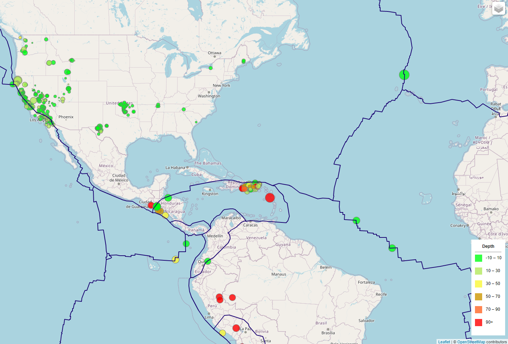

# Earthquake :: Leaflet Challenge

The United States Geological Survey, or USGS for short, is responsible for providing scientific data about natural hazards, the health of our ecosystems and environment, and the impacts of climate and land-use change. Their scientists develop new methods and tools to supply timely, relevant, and useful information about the Earth and its processes.

The USGS is interested in building a new set of tools that will allow them to visualize their earthquake data. They collect a massive amount of data from all over the world each day, but they lack a meaningful way of displaying it.

The main objective of this project is to develop a visualisation for the USGS data, allowing to better educate the public and other government organisations (and hopefully secure more funding) on issues facing our planet.

The project is organised in two main components:

* **`index.html`**: Main page, designed to receive the information for the Map using **Leaflet**, which is  prepared by the JavaScript file below;
* **`logic.js`**: JavaScript responsible to fetch the data from the available at [USGS GeoJSON Feed](http://earthquake.usgs.gov/earthquakes/feed/v1.0/geojson.php). In this particular project, it was considered the dataset for the Earthquakes identified in the current week via the URL `https://earthquake.usgs.gov/earthquakes/feed/v1.0/summary/all_week.geojson`.

Using **Leaflet**, the Map was updated bringing the following information:
* **Latitude** and **Longitude** coordinates for the Earthquakes occurred in the current week.
* For each circle in the map, it was added a popup listing some key information, like the **location**, **magnitude** of the earthquake, **depth** of the earthquake, and the **date/time** when it occurred.
* The **radius** of the circle area is relative to the **magnitude** of the earthquake
* The **color** of the circle is relative to the **depth** of the earthquake, and it is linked to the **legend** added to the map.

Finally, using the dataset available at [Tectonic Plates project repository](https://github.com/fraxen/tectonicplates), this project also highlights the Tectonic Plates in the Map. That triggered the data from the URL `https://raw.githubusercontent.com/fraxen/tectonicplates/master/GeoJSON/PB2002_boundaries.json`.

The image below represents a snapshot of the running project, which is also available at this link: [Earthquake Visualisation](https://cheibergam.github.io/leaflet-challenge/Leaflet-Part-1/)

## References
Dataset created by [the United States Geological Survey](http://earthquake.usgs.gov/earthquakes/feed/v1.0/geojson.php).